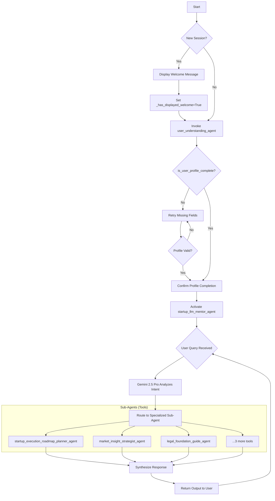

## 🚀 Installation Instructions

Follow these steps to set up and run the project locally:

### 📦 Step 1: Download the Repository

* Click on the green `Code` button at the top of the repository page.
* Select **Download ZIP** and extract it to your desired location.

### 📂 Step 2: Navigate to the Project Directory

```bash
cd path/to/extracted/folder
```

### 🐍 Step 3: Create a Virtual Environment

```bash
python -m venv .venv
```

> This will create a `.venv` folder containing your isolated Python environment.

### ⚡ Step 4: Activate the Virtual Environment

* **For Windows CMD**:

  ```bash
  .venv\Scripts\activate.bat
  ```
* **For Windows PowerShell**:

  ```powershell
  .venv\Scripts\Activate.ps1
  ```

### 📥 Step 5: Install Dependencies

```bash
pip install -r requirements.txt
```

### 🔐 Step 6: Set Up Environment Variables

* Create a `.env` file in the root folder.
* Copy contents from `.env.example` into `.env`.
* Make sure to insert your own **API key(s)** where required.

### ▶️ Step 7: Run the Application

```bash
python main.py
```

Once this is done, your agent will start and launch with the proper user interface. You're ready to go! 🎉

## FLOWCHART MECHANISM



### Flowchart Explanation:

1. **Start**: The agent begins execution.
2. **Check Profile Completeness**: 
   - If profile is incomplete, it displays a welcome message and runs the `user_understanding_agent` to collect user information.
   - If profile is complete, it skips to running the `startup_mentor_agent`.
3. **User Understanding Phase**:
   - Displays welcome message only once (`_has_displayed_welcome` flag prevents repetition).
   - Collects user data through the sub-agent.
   - If profile becomes complete, displays a confirmation message.
   - If profile remains incomplete, ends the session.
4. **Startup Mentorship Phase**:
   - Runs the `startup_llm_mentor_agent` with access to all specialized tools/sub-agents.
   - Processes user queries in a loop until session ends.
5. **Session End**: Terminates when either:
   - Profile remains incomplete after data collection attempt.
   - User ends the conversation after mentorship phase.

### Key Components:
- **Orchestrator**: Controls the flow between profile collection and mentorship phases.
- **Sub-Agents**: 
  - `user_understanding_agent`: Handles profile completion.
  - `startup_llm_mentor_agent`: Main LLM with access to 7 specialized tools (other sub-agents for different startup aspects).
- **State Management**: Uses `ctx.session.state` to track profile completeness across interactions.

The design ensures users must complete their profile before receiving specialized startup advice, creating a structured onboarding-to-mentorship pipeline.
